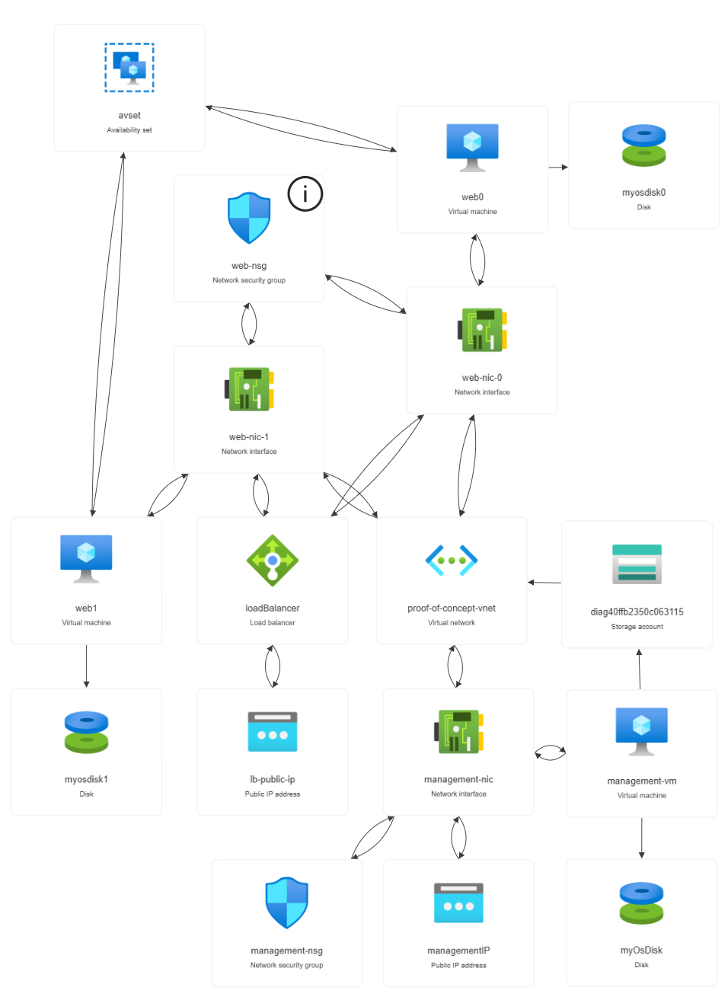
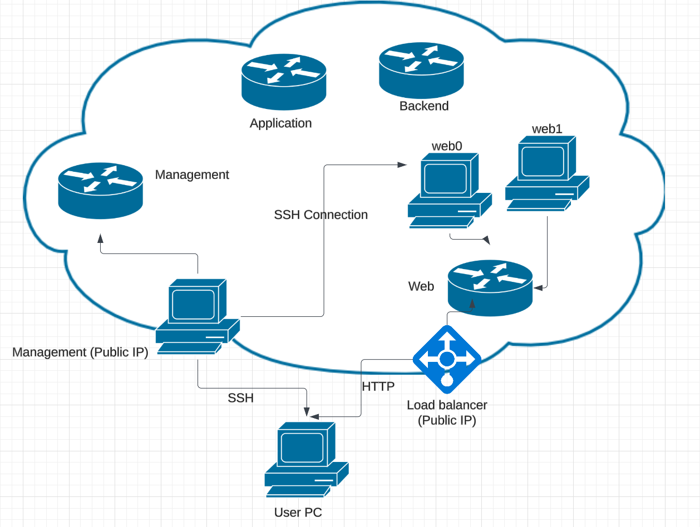

# Coalfire Azure Technical Challenge

## Description

This repository is my submission for the Coalfire Azure Technical Challenge.

## Usage

Ensure Terraform and Azure CLI are installed, and that you are logged in to Azure.

Download all .tf files, editing variables.tf to match your configuration.

Run the following commands:
```hcl
terraform init -upgrade
terraform plan
terraform apply
```

## Solution Diagram
This is the diagram generated by the Azure resource visualizer, but I find it a bit hard to follow.


This should be a bit easier to follow, this diagram shows how all of the systems are connected.


## Thought Process

Deploying networks in Azure is not something I have done before, but it was a fun learning experience. My approach to this project was to take it one step at a time. Once I familiarized myself a bit with the Terraform syntax, I was able to implement the VNet and subnets pretty quickly. I then moved on to the management VM. I initially had some issues getting the correct operating system on the VM, but that was quickly resolved. I also opted at this time to use password authentication instead of keys for SSH connections, allowing me to focus more on the core aspects of the challenge instead of extras. I also added the storage account, that was pretty straightforward as well. Where most of my challenges happened was in the web VMs. Although they are mostly similar, the big difference is the Apache install script and the load balancer. The load balancer was simple enough, but that meant that the VMs do not have their own IP addresses. This makes it essentially impossible (as far as I know) to use a remote-exec provisioner, which was my first thought to implement Apache. I tried a few different solutions, but what ended up successful was using a VM Extension called CustomScript. You'll notice that I unfortunately did not use any of Coalfire's github repositories, this is because I think the solutions there were a bit overkill for a small implementation like the one in the challenge. They contained a significant amount of features that were not necessary to the challenge. I believe that I was able to fully complete the requirements with my solution, so I am quite proud that I was able to learn a lot and complete the challenge.

## Resources Used

Here are a few of the resources I used throughout the challenge, I mostly used Microsoft and terraform documentation and examples, with a bit of searching on sites like medium and stackoverflow as well. I also used chatGPT to assist in debugging whenever an error came up and I could not figure it out.

https://learn.microsoft.com/en-us/azure/virtual-machines/linux/quick-cluster-create-terraform?tabs=azure-cli
https://learn.microsoft.com/en-us/azure/virtual-machines/linux/quick-create-terraform?tabs=azure-cli
https://medium.com/@jorge.gongora2610/how-to-set-up-an-apache-web-server-on-azure-using-terraform-f7498daa9d66
https://learn.microsoft.com/en-us/azure/load-balancer/quickstart-load-balancer-standard-public-terraform
https://registry.terraform.io/providers/hashicorp/azurerm/latest/docs/resources/storage_account
https://stackoverflow.com/questions/67297188/terraform-unable-to-run-multiple-commands-in-local-exec

